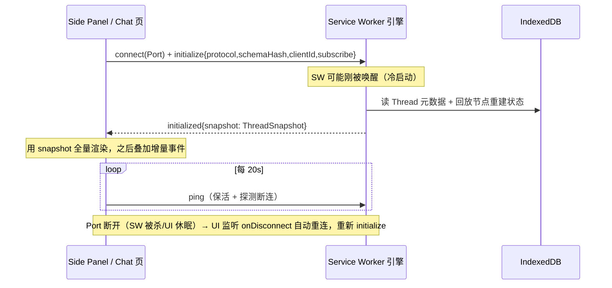

# 01 — 架构与消息协议

> 文档入口：[文档目录](./README.md) · 关联：[02 数据模型](./02-data-model.md) · [04 Agent 引擎](./04-agent-engine.md) · [06 权限](./06-permissions.md)
> 相关调研：Codex CLI 的 SQ/EQ 双队列与 app-server JSON-RPC 协议、Pi Agent 的 transport 抽象。来源见 [11 参考项目](./11-references.md)。

---

## 1. 上下文拓扑

```
┌──────────────────────────────────────────────────────────────────┐
│ Chrome                                                            │
│  ┌────────────┐  ┌────────────┐  ┌─────────────┐                 │
│  │ Side Panel │  │ Chat Tab 页 │  │ Options 页   │   （UI 上下文）  │
│  └─────┬──────┘  └─────┬──────┘  └──────┬──────┘                 │
│        └──── chrome.runtime.connect(Port) ──────┐                 │
│  ┌──────────────────────────────────────────────┴─────────────┐  │
│  │ Background Service Worker —— 引擎宿主                        │  │
│  │   RealEngineCore + EngineHost（Thread/Turn/Port）              │  │
│  │   GatekeeperService（权限拦截，见 06）                         │  │
│  │   SettingsProviderResolver（LLM 适配，见 03）                  │  │
│  │   BrowserToolGateway（L1/L2 路由，见 05）                      │  │
│  │   McpManager ↔ offscreen SDK worker（远端 MCP，见 07）          │  │
│  │   ThreadTree + PanelotDB（IndexedDB 落库，见 02）              │  │
│  └───────┬──────────────────────────┬─────────────────────────┘  │
│          │ chrome.tabs.sendMessage  │ chrome.debugger            │
│  ┌───────┴───────────┐      ┌───────┴────────────┐               │
│  │ Content Script/tab │      │ CDP（按需 attach）   │               │
│  │ L1 工具执行器+高亮UI │      │ L2 工具              │               │
│  └───────────────────┘      └────────────────────┘               │
└──────────────────────────────────────────────────────────────────┘
```

当前约束：

- 会话、审批和工具执行的状态只由 background 引擎修改；UI 是可重连的视图。
- 同一 Thread 可以同时显示在侧边栏和全屏页中，事件会广播到所有订阅它的 Port。
- UI 状态由已落库数据和实时事件合成。关闭或重开 UI 不会直接终止任务。

## 2. 三层原语：Thread / Turn / Item

沿用 Codex app-server 的分层，这是协议、存储、UI 三方共同的语言：

| 原语       | 含义                                                             | 生命周期                                                                                        |
| ---------- | ---------------------------------------------------------------- | ----------------------------------------------------------------------------------------------- |
| **Thread** | 一个会话（含分支树，见 02）                                      | 创建 → 活跃/空闲 → 归档/删除；当前不维护带 30 分钟 TTL 的 Thread 内存缓存，元数据和节点按需读库 |
| **Turn**   | 一轮完整交换：一条用户输入 → 若干 LLM 调用与工具执行 → 停止      | `turn:start` → n 个 Item → `turn:complete`；是中断（interrupt）与插话（steer）的作用单位        |
| **Item**   | 轮内的原子产出：一条助手消息、一次工具调用、一次审批、一个推理块 | 统一三段式 `item:start` → `item:delta`* → `item:complete`                                       |

Item 类型（`ItemKind`）：`user_message` / `assistant_message` / `reasoning` / `tool_call` / `approval` / `system_notice`。（协议 Item 与落库 NodeType 是两层概念：Node 还包含 `tool_result` / `approval_decision` / `turn_context` 等只落库不走事件流的类型，见 02 §2.2。）

## 3. Port 消息协议

### 3.1 总体形态

- 客户端 → 引擎：**Op**（操作，等价 Codex 的 Submission），每个 Op 带客户端生成的 `submissionId`（UUID）。
- 引擎 → 客户端：**AgentEvent**（事件），凡由某个 Op 直接引发的事件回填 `submissionId`；广播类事件（其他 UI 引发的变更）不带。
- 共享类型都定义在 `src/messaging/protocol.ts`，引擎和三个 UI 入口直接引用，不各自复制。
- `AgentEvent` 是开放联合。UI 忽略未知 `type`，以便引擎与 UI 在扩展更新期间完成版本握手。

### 3.2 Op 联合类型

```ts
// src/messaging/protocol.ts
type Op =
  | {
      type: 'initialize';
      submissionId: string;
      protocol: 'panelot/engine-v1';
      schemaHash: string;
      clientId: string;
      subscribe?: { threadId: string };
    } // 可选：连接即订阅某 Thread
  | { type: 'thread.create'; submissionId: string; preset?: string; folderId?: string } // preset = ModelPreset id（见 03）
  | { type: 'thread.subscribe'; submissionId: string; threadId: string }
  | { type: 'thread.fork'; submissionId: string; threadId: string; atNodeId: string }
  | { type: 'thread.selectBranch'; submissionId: string; threadId: string; nodeId: string }
  | {
      type: 'turn.submit';
      submissionId: string;
      threadId: string;
      input: UserInput; // 文本 + 附件 + @引用的上下文块
      overrides?: TurnOverrides;
    } // per-turn 覆盖：模型/审批策略/能力域
  // 注意：Op 是 turn.submit，引擎确认开跑后发出的事件才是 turn.start —— 两者刻意不同名
  | {
      type: 'turn.fork';
      submissionId: string;
      threadId: string;
      siblingOfNodeId: string;
      input: UserInput;
      overrides?: TurnOverrides;
    }
  | {
      type: 'turn.steer';
      submissionId: string;
      threadId: string;
      expectedTurnId: string; // 必须等于当前活跃 turn，否则报错
      input: UserInput;
    }
  | {
      type: 'turn.enqueue';
      submissionId: string;
      threadId: string;
      input: UserInput;
      overrides?: TurnOverrides;
    }
  | { type: 'turn.interrupt'; submissionId: string; threadId: string }
  | {
      type: 'queue.update' | 'queue.remove';
      submissionId: string;
      threadId: string;
      runId: string; /* update 另带 input/overrides */
    }
  | {
      type: 'run.resume' | 'run.resolveUncertain';
      submissionId: string;
      threadId: string;
      runId: string; /* resolve 另带 resolution */
    }
  | {
      type: 'approval.response';
      submissionId: string;
      approvalId: string;
      decision: ApprovalDecision;
    } // 见 06 章
  | {
      type: 'interaction.response';
      submissionId: string;
      interactionId: string;
      response: InteractionResponse;
    }
  | { type: 'ping'; submissionId: string }; // UI 心跳，兼作 SW 保活

interface TurnOverrides {
  model?: { connectionId: string; modelId: string };
  permissionPolicy?: PermissionPolicy; // 见 06
}
```

上面只列常用字段；完整联合及兼容字段以 `src/messaging/protocol.ts` 为准。当前 `thread.fork` 只创建带 `parentThreadId` 的新空 Thread，不复制来源节点；对话内“编辑重发/重新生成”走 `turn.fork`，在同一消息树上创建兄弟分支。

### 3.3 AgentEvent 联合类型摘要

```ts
type AgentEvent =
  // —— 应答类（回填 submissionId）——
  | {
      type: 'initialized';
      submissionId: string;
      protocol: 'panelot/engine-v1';
      schemaHash: string;
      snapshot?: ThreadSnapshot;
    } // 订阅时附带：当前 Thread 状态全量（重连恢复的关键）
  // fatal 是最小稳定控制信封：host 回显客户端 protocol，使旧 UI 也能解析并停止重连。
  // initialized 和其余普通事件仍严格校验当前 protocol/schemaHash。
  | {
      type: 'fatal.reload_required';
      submissionId: string;
      protocol: string;
      schemaHash: string;
      message: string;
    }
  | CommandAck
  | CommandRejected
  | { type: 'error'; submissionId?: string; code: ErrorCode; message: string; retryable: boolean }

  // —— Turn 生命周期 ——
  | {
      type: 'turn.start';
      threadId: string;
      turnId: string;
      turnKind: 'user' | 'title'; // 内部轮标记为 non-steerable
      steerable: boolean;
    }
  | {
      type: 'turn.complete';
      threadId: string;
      turnId: string;
      stopReason:
        'end' | 'max_tokens' | 'content_filter' | 'done' | 'interrupted' | 'error' | 'budget_pause';
    } // done 仅兼容旧输入
  | {
      type: 'token.usage';
      threadId: string;
      turnId: string;
      usage: { input: number; output: number; cacheRead?: number };
      costUsd?: number;
    }

  // —— Item 三段式 ——
  | {
      type: 'item.start';
      threadId: string;
      turnId: string;
      itemId: string;
      kind: ItemKind;
      meta: ItemMeta;
    } // tool_call 的 meta 含 toolName/label/参数摘要
  | {
      type: 'item.delta';
      threadId: string;
      itemId: string;
      delta: { text?: string; reasoning?: string; toolProgress?: unknown };
    }
  | {
      type: 'item.complete';
      threadId: string;
      itemId: string;
      result?: { ok: boolean; details?: unknown };
    } // details = 工具的 UI 富信息通道（见 04）

  // —— 引擎发起的双向 RPC ——
  | {
      type: 'approval.request';
      threadId: string;
      turnId: string;
      approvalId: string;
      request: ApprovalRequestPayload;
    } // 完整参数展示，见 06
  | {
      type: 'interaction.request';
      threadId: string;
      turnId: string;
      interactionId: string;
      request: InteractionRequestPayload;
    } // 提问、用户接管、页面等待、定时恢复或 MCP Elicitation
  // L1→L2 升级确认走同一事件，flags 带 'escalation_l2'（06 §5）

  // —— 广播类 ——
  | { type: 'thread.updated'; threadId: string; revision: number; patch: Partial<ThreadMeta> }
  | {
      type: 'queue.updated';
      threadId: string;
      pending: number;
      runs: { runId: string; input: UserInput; overrides?: TurnOverrides; revision: number }[];
    }
  | { type: 'run.recovery_required'; threadId: string; run: RunRecoveryState };
```

实际联合还包含 `pong`、`thread.created/forked`、`tabs.updated` 与跨 Thread 的 `activity.updated`；不要从本文复制类型定义。

### 3.4 连接与握手时序



`ThreadSnapshot` = 带 revision 的 Thread 元数据 + 当前路径消息 + 活跃 turn（若有）+ 持久 pending approvals/interactions + durable queued/recoverable Runs。EngineClient 把待确认命令保存在 `chrome.storage.session` outbox；断线后用相同 `clientId + submissionId` 重发，收到 ack/rejection 才清除。

### 3.5 背压与有界队列

- EngineHost 每 Thread 一个有界 Op 队列（容量 32）；满时立刻回 `command.rejected{code:'overloaded'}`，EngineClient 回滚乐观消息并给出可重试错误。
- `item.delta` 高频事件在引擎侧做 16ms 合帧（同一 itemId 的连续 text delta 合并）再 postMessage，降低 Port 压力。

## 4. Service Worker 生命周期策略

| 场景             | 当前实现                                                                                                                                            |
| ---------------- | --------------------------------------------------------------------------------------------------------------------------------------------------- |
| Agent 运行中     | Provider fetch、工具 Promise 和 Port 心跳在 SW 存活期间推进；用户/助手/工具节点按执行阶段 await 写入 IndexedDB                                      |
| SW 被杀、UI 仍开 | Port 断开 → UI 指数退避重连；Run reducer 恢复队列/审批，模型流进入 interrupted，只读或 retry-safe 工具可重放，结果不明的写操作进入 paused_uncertain |
| 无 UI 的后台任务 | 30s alarm 唤醒后执行同一恢复流程；队列、审批和 Run 不依赖 UI 内存，交互式授权仍需用户点击                                                           |
| 扩展更新         | 当前没有 `onUpdateAvailable` 延迟 reload 逻辑；这是目标策略而非已实现行为                                                                           |

**当前落库时机**：轮次开头原子写 `turn_context + user_message + Run state`；Provider 完成后原子写 assistant_message、usage/cost、Thread stats 与 Run 游标；工具结果与下一 Run state 同事务；审批决定、审计节点与 Run revision 同事务。`item.delta` 不落库，SW 中止的模型流不会伪装成完成。

## 5. 工具执行双通道路由

`BrowserToolGateway` 对 Agent loop 暴露统一的 `AgentTool` 接口（见 04），内部路由：

```
tool_call
  → Gatekeeper 裁决（06）
  → 路由：
     ├─ L0/L1 → chrome.tabs.sendMessage(tabId, {tool, params}) → content script 执行 → 结果回传
     │          content script 未注入时先 chrome.scripting.executeScript 注入（幂等）
     ├─ L2   → CdpManager 串行 attach/switch → chrome.debugger.sendCommand；是否审批由 06 的策略/规则裁决
     ├─ MCP  → McpManager.callTool（07）
     └─ 内置 → 引擎内直接执行（fetch_url / memory 等）
```

- content script 消息协议同样定义在 `protocol.ts`（`ContentScriptOp` / `ContentScriptResult`），带超时（默认 10s）与单次重注入重试。
- debugger attach 以 tab 为粒度记录；当前在最后一次 CDP 调用空闲 30s 后自动 detach，没有 turn-complete 立即 detach。

## 6. 当前约束

- `protocol` 或 schema hash 不匹配时，EngineHost 返回 `fatal.reload_required` 并断开；该最小控制信封对版本保持可解析，host 回显请求方 `protocol`，使旧 UI 能进入 `reloadRequired` 并停止重连。`initialized` 与其余普通事件仍只接受当前协议和 schema hash，不提供行为兼容分支。未知 AgentEvent 仍应忽略。
- 多窗口 Side Panel：各窗口独立选择 Thread（`chrome.sidePanel` 本身 per-window），同一 Thread 被多处订阅时靠事件广播保持一致，无须额外绑定机制。
- L1→L2 升级确认合并进 `approval.request`（flag `escalation_l2`，见 06 §5），不设独立的 `escalation.request` 事件——同一张审批卡片、同一套决策语义，UI 只多渲染一条横幅提示。
