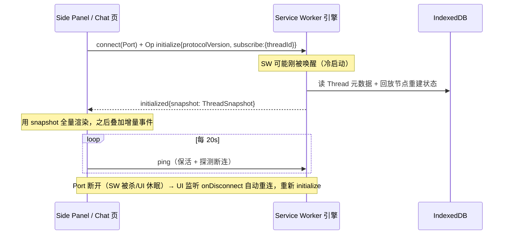

# 01 — 整体架构与消息协议

> 上级文档：[DESIGN.md](../DESIGN.md) · 关联：[02 数据模型](./02-data-model.md) · [04 Agent 引擎](./04-agent-engine.md) · [06 权限](./06-permissions.md)
> 借鉴来源：Codex CLI 的 SQ/EQ 双队列与 app-server JSON-RPC 协议、Pi Agent 的 transport 抽象（详见 [11 参考项目](./11-references.md)）

---

## 1. 上下文拓扑

```
┌──────────────────────────────────────────────────────────────────┐
│ Chrome                                                            │
│  ┌────────────┐  ┌────────────┐  ┌─────────────┐                 │
│  │ Side Panel │  │ Chat Tab 页 │  │ Options 页   │   （UI 上下文）  │
│  └─────┬──────┘  └─────┬──────┘  └──────┬──────┘                 │
│        └──── chrome.runtime.connect(Port) ──────┐                 │
│  ┌──────────────────────────────────────────────┴─────────────┐  │
│  │ Background Service Worker —— 引擎宿主                        │  │
│  │   AgentEngine（Thread 管理、loop）                            │  │
│  │   Gatekeeper（权限拦截，见 06）                                │  │
│  │   ProviderRegistry（LLM 适配，见 03）                          │  │
│  │   BrowserToolGateway（L1/L2 路由，见 05）                      │  │
│  │   McpManager（远端 MCP，见 07）                                │  │
│  │   RolloutStore（IndexedDB 落库，见 02）                        │  │
│  └───────┬──────────────────────────┬─────────────────────────┘  │
│          │ chrome.tabs.sendMessage  │ chrome.debugger            │
│  ┌───────┴───────────┐      ┌───────┴────────────┐               │
│  │ Content Script/tab │      │ CDP（按需 attach）   │               │
│  │ L1 工具执行器+高亮UI │      │ L2 工具              │               │
│  └───────────────────┘      └────────────────────┘               │
└──────────────────────────────────────────────────────────────────┘
```

原则：

- **引擎唯一**：所有状态变更（会话、审批、工具执行）只发生在 background；UI 是可重连的薄视图。
- **UI 可多开**：同一 Thread 可被侧边栏和全屏页同时订阅，事件广播到所有订阅 Port。
- **UI 无本地真相**：UI 状态 = 落库数据回放 + 实时事件叠加。UI 崩溃/关闭不影响任务。

## 2. 三层原语：Thread / Turn / Item

沿用 Codex app-server 的分层，这是协议、存储、UI 三方共同的语言：

| 原语 | 含义 | 生命周期 |
|---|---|---|
| **Thread** | 一个会话（含分支树，见 02） | 创建 → 活跃/空闲 → 归档/删除；引擎侧 30 分钟无订阅且无活动即从内存卸载（数据在库中） |
| **Turn** | 一轮完整交换：一条用户输入 → 若干 LLM 调用与工具执行 → 停止 | `turn:start` → n 个 Item → `turn:complete`；是中断（interrupt）与插话（steer）的作用单位 |
| **Item** | 轮内的原子产出：一条助手消息、一次工具调用、一次审批、一个推理块 | 统一三段式 `item:start` → `item:delta`* → `item:complete` |

Item 类型（`ItemKind`）：`assistant_message` / `reasoning` / `tool_call` / `approval` / `system_notice`。

## 3. Port 消息协议

### 3.1 总体形态

- 客户端 → 引擎：**Op**（操作，等价 Codex 的 Submission），每个 Op 带客户端生成的 `submissionId`（UUID）。
- 引擎 → 客户端：**AgentEvent**（事件），凡由某个 Op 直接引发的事件回填 `submissionId`；广播类事件（其他 UI 引发的变更）不带。
- **共享类型单一来源**：全部类型定义在 `src/messaging/protocol.ts`，引擎与三个 UI 入口 import 同一份，禁止各自复制。
- **前向兼容**：`AgentEvent` 是开放联合；UI 对未知 `type` 一律忽略（不报错、不崩），保证引擎先行迭代。

### 3.2 Op 联合类型

```ts
// src/messaging/protocol.ts
type Op =
  | { type: 'initialize'; submissionId: string;
      protocolVersion: number;                    // 客户端协议版本
      subscribe?: { threadId: string } }          // 可选：连接即订阅某 Thread
  | { type: 'thread.create'; submissionId: string;
      preset?: string; folderId?: string }        // preset = ModelPreset id（见 03）
  | { type: 'thread.subscribe'; submissionId: string; threadId: string }
  | { type: 'thread.fork'; submissionId: string; threadId: string; atNodeId: string }
  | { type: 'turn.submit'; submissionId: string; threadId: string;
      input: UserInput;                           // 文本 + 附件 + @引用的上下文块
      overrides?: TurnOverrides }                 // per-turn 覆盖：模型/审批策略/能力域
      // 注意：Op 是 turn.submit，引擎确认开跑后发出的事件才是 turn.start —— 两者刻意不同名
  | { type: 'turn.steer'; submissionId: string; threadId: string;
      expectedTurnId: string;                     // 必须等于当前活跃 turn，否则报错
      input: UserInput }
  | { type: 'turn.enqueue'; submissionId: string; threadId: string; input: UserInput }
  | { type: 'turn.interrupt'; submissionId: string; threadId: string }
  | { type: 'approval.response'; submissionId: string;
      approvalId: string;
      decision: ApprovalDecision }                // 见 06 章
  | { type: 'thread.compact'; submissionId: string; threadId: string }  // 手动压缩
  | { type: 'ping'; submissionId: string };       // UI 心跳，兼作 SW 保活

interface TurnOverrides {
  model?: { connectionId: string; modelId: string };
  approvalPolicy?: ApprovalPolicy;      // 见 06
  capabilityScope?: CapabilityScope;    // 见 06
}
```

### 3.3 AgentEvent 联合类型

```ts
type AgentEvent =
  // —— 应答类（回填 submissionId）——
  | { type: 'initialized'; submissionId: string;
      protocolVersion: number;
      snapshot?: ThreadSnapshot }        // 订阅时附带：当前 Thread 状态全量（重连恢复的关键）
  | { type: 'error'; submissionId?: string; code: ErrorCode; message: string; retryable: boolean }
  | { type: 'overloaded'; submissionId: string }   // 有界队列满，UI 退避重试

  // —— Turn 生命周期 ——
  | { type: 'turn.start'; threadId: string; turnId: string;
      turnKind: 'user' | 'compaction' | 'title';   // 内部轮标记为 non-steerable
      steerable: boolean }
  | { type: 'turn.complete'; threadId: string; turnId: string;
      stopReason: 'done' | 'interrupted' | 'error' | 'budget_pause' }
  | { type: 'token.usage'; threadId: string; turnId: string;
      usage: { input: number; output: number; cacheRead?: number };
      costUsd?: number; contextPct: number }

  // —— Item 三段式 ——
  | { type: 'item.start'; threadId: string; turnId: string; itemId: string;
      kind: ItemKind; meta: ItemMeta }             // tool_call 的 meta 含 toolName/label/参数摘要
  | { type: 'item.delta'; itemId: string;
      delta: { text?: string; reasoning?: string; toolProgress?: unknown } }
  | { type: 'item.complete'; itemId: string;
      result?: { ok: boolean; details?: unknown } } // details = 工具的 UI 富信息通道（见 04）

  // —— 引擎发起的双向 RPC ——
  | { type: 'approval.request'; threadId: string; turnId: string;
      approvalId: string;
      request: ApprovalRequestPayload }            // 完整参数展示，见 06
  | { type: 'escalation.request'; threadId: string; approvalId: string;
      reason: string }                             // L1→L2 升级确认（会出现调试横幅）

  // —— 广播类 ——
  | { type: 'thread.updated'; threadId: string; patch: Partial<ThreadMeta> }  // 标题生成、归档等
  | { type: 'queue.updated'; threadId: string; pending: number };             // 排队消息数
```

### 3.4 连接与握手时序



`ThreadSnapshot` = Thread 元数据 + 当前路径消息（由 `buildSessionContext` 派生，见 02）+ 活跃 turn 状态（若有）+ 待处理审批列表。**重连后 UI 不需要自己缝合断档**——快照即真相。

### 3.5 背压与有界队列

- 引擎侧每 Thread 一个有界 Op 队列（容量 32）；满时立刻回 `overloaded`，UI 指数退避（500ms 起，×2，上限 8s）重试。
- `item.delta` 高频事件在引擎侧做 16ms 合帧（同一 itemId 的连续 text delta 合并）再 postMessage，降低 Port 压力。

## 4. Service Worker 生命周期策略

| 场景 | 对策 |
|---|---|
| Agent 运行中 | 活跃 fetch（LLM 流）+ Port 心跳天然续命；每个 Item complete 后同步落库（checkpoint） |
| SW 被杀、UI 仍开 | Port 断开 → UI 自动重连触发 SW 重启 → `initialize` 回放恢复 → 若被杀时有未完成 turn，snapshot 标记 `stopReason: 'error'` 并提供「继续」按钮（重放后从最后 checkpoint 续跑） |
| 无 UI 的后台任务 | `chrome.alarms`（最小 30s）周期唤醒检查任务队列；长任务每步落库使中断无损 |
| 扩展更新 | `onUpdateAvailable` 时若有活跃 turn，延迟 reload 至 turn 完成 |

**落库时机规范**：`turn.start`、每个 `item.complete`、`approval` 决策、`turn.complete` 五类事件同步写 IndexedDB；`item.delta` 不落库（可由 complete 重建）。这保证任意时刻被杀，损失不超过「当前正在流式的一个 Item」。

## 5. 工具执行双通道路由

`BrowserToolGateway` 对 Agent loop 暴露统一的 `AgentTool` 接口（见 04），内部路由：

```
tool_call
  → Gatekeeper 裁决（06）
  → 路由：
     ├─ L0/L1 → chrome.tabs.sendMessage(tabId, {tool, params}) → content script 执行 → 结果回传
     │          content script 未注入时先 chrome.scripting.executeScript 注入（幂等）
     ├─ L2   → 确保 debugger attached（未 attach 则走 escalation.request）→ chrome.debugger.sendCommand
     ├─ MCP  → McpManager.callTool（07）
     └─ 内置 → 引擎内直接执行（fetch_url / memory 等）
```

- content script 消息协议同样定义在 `protocol.ts`（`ContentScriptOp` / `ContentScriptResult`），带超时（默认 10s）与单次重注入重试。
- debugger attach 以 tab 为粒度记录；turn 结束或 Thread 空闲 30s 自动 detach（最小化横幅时间）。

## 6. 开放问题

- [ ] `initialize` 的 `protocolVersion` 不匹配时的降级策略（V1：只警告不阻断）。
- [ ] 多窗口场景下 Side Panel 的 per-window 会话绑定（`chrome.sidePanel` 是 per-window 的，V1 各窗口独立选择 Thread）。
- [ ] `escalation.request` 是否合并进 `approval.request`（当前分开，语义更清晰，UI 成本略高）。
