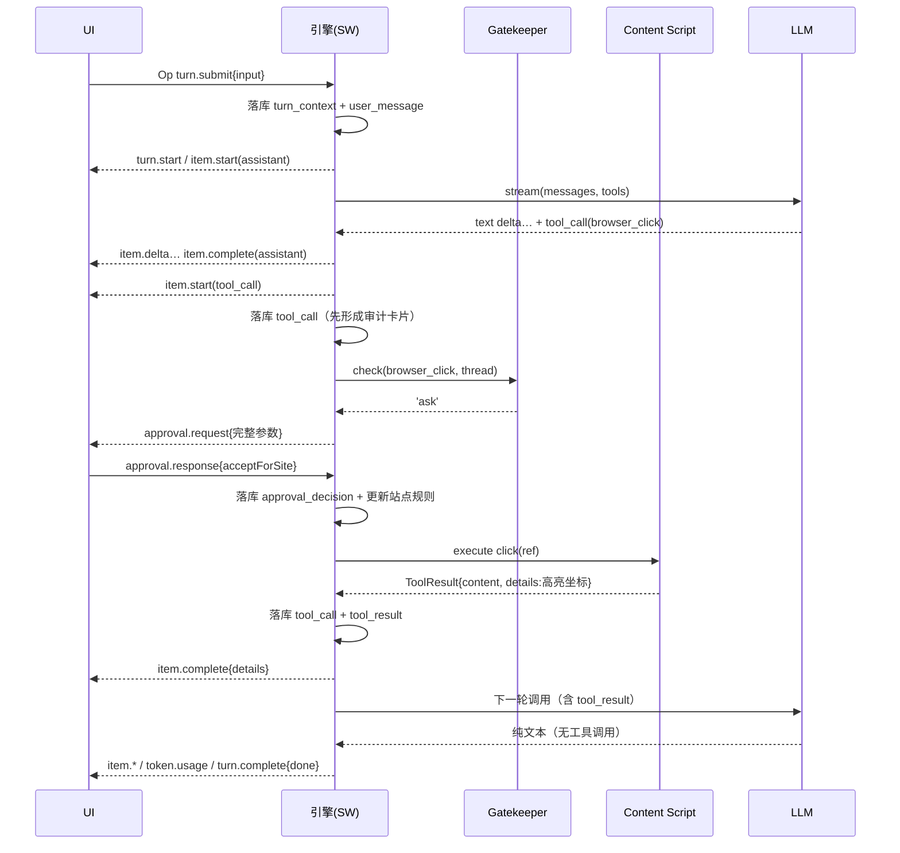
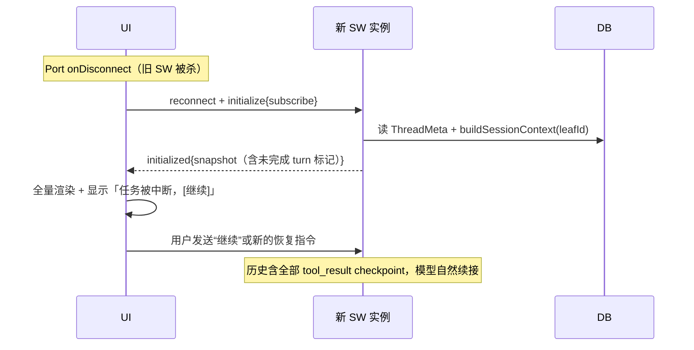

# 04 — Agent 核心引擎

> 上级文档：[DESIGN.md](../DESIGN.md) · 关联：[01 架构](./01-architecture.md) · [02 数据模型](./02-data-model.md) · [06 权限](./06-permissions.md) · [10 提示词](./10-prompts.md)
> 借鉴来源：Pi Agent 的极简 loop / AgentTool 双通道；Codex 的 steering-queueing-interrupt 三通路与 turnKind

---

## 1. 设计哲学

**Pi 的极简内核 + Codex 的安全外壳。** loop 本身保持最小——循环到模型不再调工具为止；复杂度全部推到外层（Gatekeeper、能力域、UI）。不加没有用例的旋钮：

- 步数分两级：25 步**软提醒**（落一条 `system_notice`，并在下一次 LLM 调用注入反思提示）；超过 60 次工具调用时直接暂停 turn，返回 `stopReason:'budget_pause'`。当前不会额外发起一次“禁用工具的收尾 LLM 调用”；继续需用户再次发送；
- **token 预算**（可选配置）：超预算同样 `turn.complete{stopReason:'budget_pause'}`，可继续。

## 2. Agent Loop

```ts
// src/agent/loop.ts —— 结构化伪代码；精确控制流以源码为准
async function runTurn(thread: Thread, input: UserInput, overrides?: TurnOverrides) {
  transaction(turn_context + user_message + Run.streaming_model);
  emit('turn.start');

  while (true) {
    const messages = buildSessionContext(thread.leafId);   // 02 §4

    const stream = provider.stream(messages, tools, signal);   // 03 章适配层
    for await (const ev of stream) emitDelta(ev);              // 文本/推理增量转 item.delta
    const { message, toolCalls, usage } = await stream.final();

    transaction(assistant_message + usage/cost + stats + Run.stepCursor);
    emit('item.complete'); emit('token.usage');
    consumeSteerQueue();                              // §3：插话在此注入

    if (toolCalls.length === 0) break;                // 正常完成条件

    for (const call of toolCalls) {
      appendNode(tool_call);                          // 校验/审批失败也留下审计卡片
      const verdict = await gatekeeper.check(call, thread);      // 06 章
      if (verdict === 'ask') {
        const decision = await requestApproval(call); // 双向 RPC，挂起等待
        transaction(approval_decision + ApprovalRecord + Run.revision);
      }
      try {
        const result = await tool.execute(call.id, call.params, signal, onUpdate);
        transaction(tool_result{ ok:true, contentForLlm: result.content, details: result.details }
                    + Run.streaming_model);
      } catch (e) {
        appendNode(tool_result{ ok:false, contentForLlm: [text(errorFor(e))] });  // 让模型自纠
      }
    }
  }
  emit('turn.complete', stopReason);
}
```

除“模型不再调用工具”外，interrupt、token budget、60 步上限和连续失败熔断也会退出 loop。标题生成由 `RealEngineCore.startTurn()` 在首轮开始时并行触发：先写首行 fallback，再 best-effort 调 task model；当前没有 follow-up 建议任务。

行为规范：

- **错误靠 throw**：工具失败抛异常，引擎捕获后以 `isError` 语义回填给模型，loop 继续——模型自己重试或换路（元素找不到→重新快照，是 05 章工具的标准自纠路径）。
- **中断（interrupt）**：abort `signal` → 当前 fetch 与工具执行终止（L2 工具安全 detach）→ 已落库节点保留 → `turn.complete{stopReason:'interrupted'}`。
- **结束的定义**：`turn.complete` 在所有落库写入 ack 之后才发出（Pi 的 "await 所有订阅者" 语义）——防 SW 在持久化前被挂起。

## 3. Steering / Queueing / Interrupt 三通路

| 通路 | Op | 语义 | 约束 |
|---|---|---|---|
| **插话 steer** | `turn.steer{expectedTurnId}` | 注入**当前轮**：追加一条 user_message，在当前 LLM 调用结束后、下一次调用前生效 | `expectedTurnId` 不匹配报错；协议保留 non-steerable turnKind，但当前标题生成不走 runTurn |
| **排队 enqueue** | `turn.enqueue` | 当前轮跑完后作为**下一轮**执行 | 队列有界（8 条），UI 显示 `queue.updated` |
| **打断 interrupt** | `turn.interrupt` | 立即停止当前轮 | 总是允许 |

UI 交互映射（见 09）：Agent 运行中输入框可继续打字，`Enter` = steer（不可插话时自动降级为 enqueue 并提示），`Shift+Alt+Enter` = 显式排队，`Esc` = interrupt。

## 4. AgentTool 接口

```ts
// src/agent/tool.ts —— 所有工具（浏览器/MCP/内置）的统一形态
interface AgentTool<P = unknown, D = unknown> {
  name: string;                  // 'browser_click'
  label: string;                 // UI 显示："点击元素"
  description: string;           // 给 LLM（文案见 10 §3）
  parameters: z.ZodType<P>;      // zod schema → 同时生成 JSON Schema 发给 LLM
  inputSchema?: object;          // MCP 等远端工具的原始 JSON Schema，优先原样发给 Provider
  level: 'L0' | 'L1' | 'L2' | 'mcp' | 'builtin';
  effects: 'read' | 'write';     // Gatekeeper 默认裁决的依据（06）
  recovery?: 'retry-safe' | 'inspect-first' | 'never-retry';
  resolveTarget?(params: P): Promise<{ tabId?, frameId?, origin?, serverId? }>;
  execute(
    toolCallId: string,
    params: P,
    signal: AbortSignal,
    onUpdate?: (partial: { progressText: string; details?: D }) => void,
  ): Promise<ToolResult<D>>;
}

interface ToolResult<D> {
  content: ContentBlock[];   // 给 LLM：精简文本/图片，计入上下文
  details?: D;               // 给 UI：截图、快照 diff、高亮坐标——不进 LLM，经 item.complete 下发
}
```

- **content/details 双通道是硬规范**：任何工具不得把 UI 富信息塞进 content（污染上下文），也不得把 LLM 需要的关键结论只放 details。
- 参数校验：LLM 给的原始参数先过 zod；失败不 throw 给用户，而是把校验错误作为 tool_result 回给模型自纠。
- `onUpdate`：长工具（等待页面加载、滚动抓取）推进度 → `item.delta{toolProgress}`。

## 5. 恢复语义

每个 Thread 由 `ThreadActor` 串行调度，Run 使用固定状态机并持久化环境、步骤游标与 `PreparedToolCall`。SW 重启时：queued/preparing 自动继续；waiting_approval 从 approvals 表恢复；只读或 retry-safe 工具可重放；已开始且结果不明的写操作进入 `paused_uncertain`，只能由用户选择 retry / mark_done / fail；模型流中断进入 `interrupted`。`ResolvedRunEnvironment` 固化实际 connection/model、参数、Preset prompt、工具级别、审批策略、能力域、Skills、prompt version 与能力/价格元数据，恢复不重新解析可变设置。

## 6. 关键时序图

### 6.1 一轮 turn（含审批与工具）



### 6.2 SW 休眠恢复



## 7. Transport 抽象

```ts
interface EngineTransport {
  send(op: Op): void;
  onEvent(cb: (ev: AgentEvent) => void): () => void;
}
// 实现1：PortTransport（生产，chrome.runtime Port）
// 实现2：DirectTransport（单测/Node 集成测试，直连引擎实例，不依赖 chrome API）
```

引擎与 UI 组件对 transport 无感——这使 Agent loop 可在 Vitest 里用 mock provider + DirectTransport 完整回归，不开浏览器。

## 8. 已定事项

- steer 注入点固定在「LLM 调用间隙」，不做工具执行间隙注入：工具执行通常在秒级完成，中途注入的收益小，而中断/恢复工具执行的复杂度高。等不及的场景用 `interrupt`。
- 不做子代理（spawn_subagent）：单 loop + 好快照的收益先于多 Agent 编排；Thread 的 `parentThreadId` 字段由 fork 使用。
