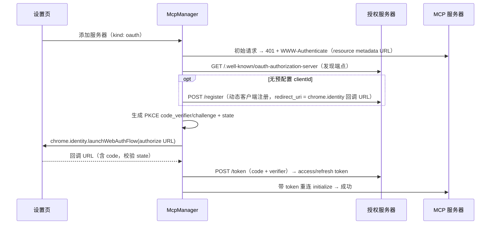

# 07 — 远端 MCP 支持

> 文档索引：[README.md](../README.md) · 关联：[04 Agent 引擎](./04-agent-engine.md) · [06 权限](./06-permissions.md) · [09 界面](./09-ui.md)

---

## 1. 范围与架构

仅支持远端 MCP，扩展内直连、零安装。本地 stdio 服务器需要 Native Host，超出「零本地程序」原则，不做。运行时使用 `@modelcontextprotocol/sdk` 的浏览器安全 Client 与 Streamable HTTP transport；不实现旧式独立 SSE endpoint transport。

```
McpManager (background)
 ├─ McpWorkerClient —— 轻量 runtime RPC 与 capability 镜像
 ├─ offscreen document —— SDK Client/StreamableHTTPClientTransport（每服务器一会话）
 ├─ AuthManager —— Bearer / OAuth 2.1（token 刷新、过期重授权）
 └─ Registry 桥接 —— tools → AgentTool；prompts → `/server:prompt`；resources → `@`
```

offscreen document 只承载网络会话，没有可见 UI 或页面访问能力；把 SDK 从 background bundle 分离是为满足 MV3 Service Worker 生命周期与包体预算。

## 2. 服务器配置

```ts
// chrome.storage.local: 'mcp_servers'
interface McpServerConfig {
  id: string; name: string;
  url: string;                               // https://mcp.example.com/mcp
  auth:
    | { kind: 'none' }
    | { kind: 'bearer'; token: string }
    | { kind: 'oauth'; clientId?: string;    // 缺省走动态客户端注册（DCR）
        scopes?: string[];
        tokens?: { access: string; refresh?: string; expiresAt: number } };  // access 存 storage.session
  enabled: boolean;
  disabledTools: string[];                    // 逐工具启停
  connectOnStartup: boolean;                  // false 时首次使用再懒连接
}
```

设置页支持粘贴 JSON 导入（兼容 Claude Code `mcpServers` 与 Cursor 配置片段）、连接/断开、逐工具启停、OAuth 授权和删除。Provider/MCP/page origin 统一经 `HostPermissionBroker`；缺少 host permission 时先形成审批，浏览器权限请求由用户点击触发。

后台启动只连接 `enabled && connectOnStartup` 的服务器；其它 enabled 服务器在首次列能力或调用时懒连接。storage 变化会 reconcile 已连接会话。

## 3. OAuth 2.1 时序



- redirect_uri 固定为 `https://<extension-id>.chromiumapp.org/mcp-oauth`；
- OAuth access token 仅存 `chrome.storage.session`；refresh token 和 Bearer token 在 local 中使用本机 AES-GCM 封装。401 时先尝试 refresh/重新授权，失败把 manager 状态标记为“需要重新授权”；
- 当前 OAuth 从设置页“授权”按钮触发 `launchWebAuthFlow({interactive:true})`。无 UI 的后台任务无法完成交互式重授权，manager 只会进入 error 状态；尚无任务暂停通知或系统通知链路。

## 4. 能力消费映射

| MCP 能力 | 当前状态 | 说明 |
|---|---|---|
| Tools | 已接入 `AgentTool`，name = `mcp__{serverId}__{tool}` | `annotations.readOnlyHint` → effects:'read'，未声明一律 'write'；原始 inputSchema 通过 `AgentTool.jsonSchema` 原样送达 Provider，运行时保留宽松解析并由 server 最终校验 |
| Prompts | 已接入 `/server:prompt` 与参数表单 | manager 调用 `prompts/get`，返回内容作为不可信 ContextBlock 附加到用户消息 |
| Resources | 已接入 `@` 搜索与读取 | `resources/list` 形成候选；选择后 `readResource`，内容随机定界且标记 MCP provenance |
| notifications/tools/list_changed | 已监听 | offscreen Client 刷新 catalog 并通知 background 重建工具注册表 |

工具调用超时 60s；结果按 05 §7 同样的体积规范截断。

## 5. 健康与调试

- manager 内存中有 `disconnected → connecting → ready → error(reason)` 状态机和错误归因函数；
- 设置页可读取 manager 状态、tool count、catalog，并维护 disabledTools；
- 尚无每服务器最近 50 条请求/响应日志、日志抽屉或导出能力。

## 6. 非目标

- Elicitation（MCP 服务器主动向用户提问）：不支持。工具结果里的提问文本可正常回给模型，但当前没有独立 `ask_user` 工具，只能由模型在普通回复中向用户提问。
- resources subscribe 的推送更新。
- 本地 stdio 服务器（需 Native Host，违反零本地程序原则）。
