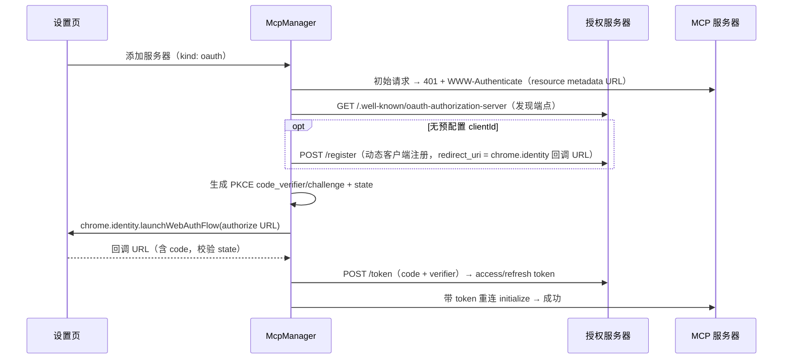

# 07 — 远端 MCP 支持

> 上级文档：[DESIGN.md](../DESIGN.md) · 关联：[04 Agent 引擎](./04-agent-engine.md) · [06 权限](./06-permissions.md) · [09 界面](./09-ui.md)

---

## 1. 范围与架构

仅支持远端 MCP（Streamable HTTP，兼容旧 SSE 回退），扩展内直连、零安装。本地 stdio 服务器需要 Native Host，超出「零本地程序」原则，不做；transport 已是抽象层，留有扩展缝：

```
McpManager (background)
 ├─ McpClient (per server) —— @modelcontextprotocol/sdk Client
 │    └─ transport: StreamableHttpTransport（唯一实现）
 ├─ AuthManager —— Bearer / OAuth 2.1（token 刷新、过期重授权）
 └─ Registry 桥接 —— tools → AgentTool 注册表；prompts → 斜杠命令；resources → @ 引用
```

## 2. 服务器配置

```ts
// chrome.storage.local: 'mcp_servers'
interface McpServerConfig {
  id: string; name: string;
  url: string;                               // https://mcp.example.com/mcp
  auth:
    | { kind: 'none' }
    | { kind: 'bearer'; token: string }
    | { kind: 'oauth'; clientId?: string;    // 缺省走动态客户端注册（DCR）
        scopes?: string[];
        tokens?: { access: string; refresh?: string; expiresAt: number } };  // access 存 storage.session
  enabled: boolean;
  disabledTools: string[];                    // 逐工具启停
  connectOnStartup: boolean;                  // false = 首次被会话使用时才连接（默认，省资源）
}
```

添加入口：设置页表单 / **粘贴 JSON 导入**（兼容 Claude Code `mcpServers` 与 Cursor 配置片段，解析 `url`/`type: http|sse`/`headers.Authorization`）。添加时动态申请该 origin 的 host permission。

## 3. OAuth 2.1 时序



- redirect_uri 固定为 `https://<extension-id>.chromiumapp.org/mcp-oauth`；
- access token 存 `chrome.storage.session`（浏览器重启即失效），refresh token 存 local；401 时先静默 refresh，失败标记「需要重新授权」并在设置页/工具调用错误中提示；
- `launchWebAuthFlow` 需要用户手势场景之外也可运行（interactive: true 弹窗）；无 UI 的后台任务遇到需重授权 → 任务暂停 + 系统通知。

## 4. 能力消费映射

| MCP 能力 | Panelot 映射 | 说明 |
|---|---|---|
| Tools | `AgentTool`，name = `mcp__{serverId}__{tool}` | schema 直转 zod（经 json-schema-to-zod）；`annotations.readOnlyHint` → effects:'read'，未声明一律 'write'（从严）→ Gatekeeper 默认 ask |
| Prompts | 斜杠命令 `/{serverName}:{prompt}` | 带参数的 prompt 弹变量表单（09 §5） |
| Resources | `@` 引用菜单条目 | 选中后 `resources/read` 注入为上下文块；不支持 subscribe 推送 |
| notifications/tools/list_changed | 刷新注册表 | 增量更新工具面板 |

工具调用超时 60s；结果按 05 §7 同样的体积规范截断。

## 5. 健康与调试

- 连接状态机：`disconnected → connecting → ready → error(reason)`，设置页实时显示；
- 每服务器保留最近 50 条请求/响应日志（内存态 + 可导出），排查中转/鉴权问题；
- initialize 失败的错误归因：网络不可达 / 401 需授权 / 协议版本不符 / CORS（提示检查 host permission）。

## 6. 非目标

- Elicitation（MCP 服务器主动向用户提问）：不支持——工具结果里的提问文本会正常回给模型，模型可转述后用 `ask_user` 向用户提问，不阻塞主流程。
- resources subscribe 的推送更新。
- 本地 stdio 服务器（需 Native Host，违反零本地程序原则）。
