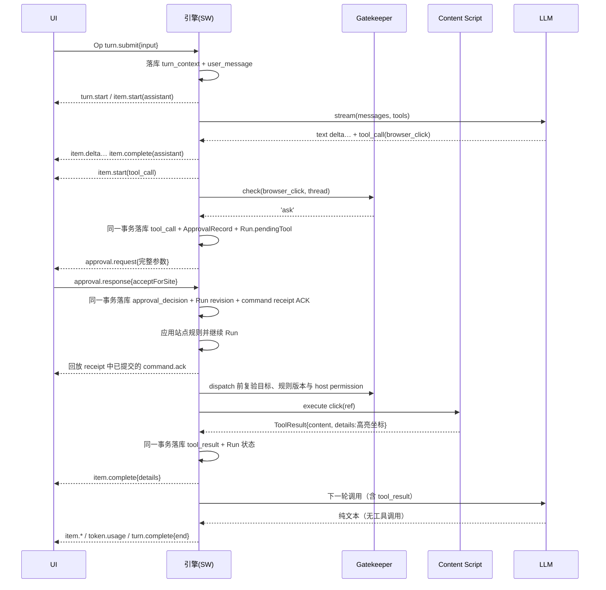
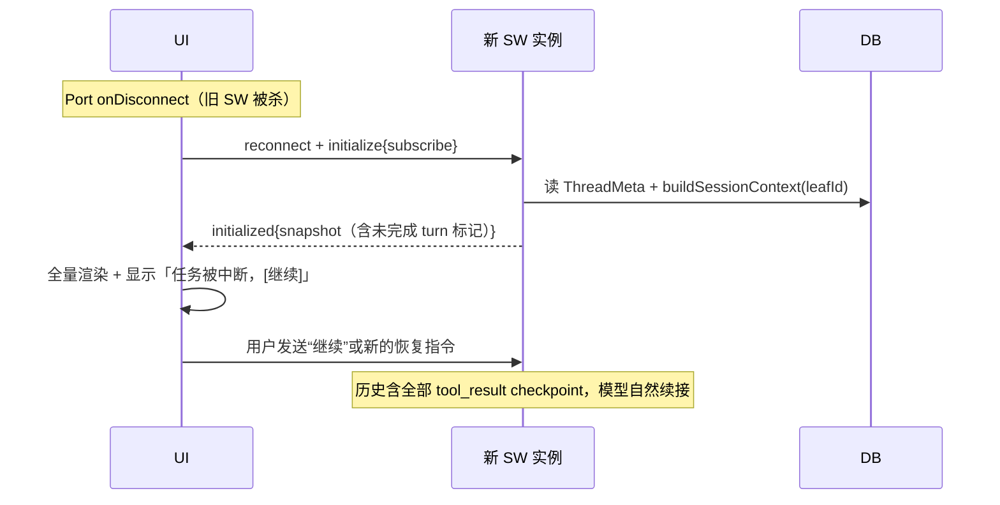

# Agent 引擎

> 文档入口：[用户指南](../guide/index.md) · 关联：[架构](./architecture.md) · [数据模型](./data-model.md) · [权限](./permissions.md) · [提示词](./prompts.md)
> 相关调研：Pi Agent 的 loop 与 AgentTool 双通道，以及 Codex 的 steering、queueing、interrupt 和 turnKind。

---

## 1. 运行方式

Agent loop 会一直运行到模型不再请求工具。审批、工具范围和界面状态由 loop 外的 Gatekeeper、运行环境和 UI 处理。工具调用没有按次数设置的提醒或上限；token 预算仍可暂停本轮任务。

- **token 预算**（可选配置）：超预算时 `turn.complete{stopReason:'budget_pause'}`，可继续；这是资源配置，不是步数限制；
- 连续 3 次工具失败时，loop 会提醒模型更换路径；连续 5 次失败后停止工具执行，并让模型在禁用工具的情况下给出一次收尾回复。成功调用会重置计数，用户拒绝和策略拒绝不计为工具故障。

## 2. Agent Loop

```ts
// src/agent/loop.ts —— 结构化伪代码；精确控制流以源码为准
async function runTurn(thread: Thread, input: UserInput, overrides?: TurnOverrides) {
  transaction(turn_context + user_message + Run.streaming_model);
  emit('turn.start');

  while (true) {
    const cutoff = snapshotAdmittedSteers();               // 同步线性化边界，不等待队列静默
    await materializeSteersAfterCurrentLeaf(cutoff);        // 只在安全边界推进持久化路径
    const messages = await buildSessionContext(thread.leafId);

    const stream = provider.stream(messages, tools, signal);   // Provider 适配层
    for await (const ev of stream) emitDelta(ev);              // 文本/推理增量转 item.delta
    const { message, toolCalls, usage } = await stream.final();

    transaction(assistant_message + usage/cost + stats + Run.stepCursor);
    emit('item.complete'); emit('token.usage');

    if (toolCalls.length === 0 && !hasPendingSteerOverlay()) break;

    for (const call of toolCalls) {
      prepareStableNode(tool_call);                   // 先构造稳定身份，尚不暴露半完成状态
      const verdict = await gatekeeper.check(call, thread);      // 权限裁决层
      if (verdict === 'ask') {
        transaction(tool_call + ApprovalRecord + Run.pendingTool);
        const decision = await requestApproval(call); // 双向 RPC，挂起等待
        transaction(approval_decision + ApprovalRecord + Run.revision);
      }
      try {
        const result = await tool.execute(call.id, call.params, signal, onUpdate);
        transaction(tool_result{ ok:true, contentForLlm: result.content, details: result.details }
                    + Run.streaming_model);
      } catch (e) {
        appendNode(tool_result{ ok:false, contentForLlm: [text(errorFor(e))] });  // 让模型自纠
      }
    }
  }
  emit('turn.complete', stopReason);
}
```

除“模型不再调用工具”外，interrupt、token budget 和连续失败熔断也会退出 loop。标题生成由 `RealEngineCore.startTurn()` 在首轮开始时并行触发：先写首行 fallback，再 best-effort 调 task model；当前没有 follow-up 建议任务。

行为规范：

- 工具失败时抛出异常。引擎把错误作为 `isError` tool result 返回模型，loop 继续；模型可以重新读取页面或换一种方法。
- interrupt 会 abort 当前 fetch 和工具执行，L2 工具随后 detach。已经落库的节点保留，终态为 `turn.complete{stopReason:'interrupted'}`。
- 每个 `assistant_message` 保存实际 `providerStopReason`。中间的 `tool_use` 会继续执行工具，不作为 turn 终态；最终的 `end`、`max_tokens` 和 `content_filter` 会进入 Run 与 `turn.complete`。后两种情况由 UI 提示回复可能不完整。
- `turn.complete` 只在本轮所有落库写入得到 ack 后发出，避免 SW 在持久化完成前挂起。

## 3. Steering / Queueing / Interrupt 三通路

| 通路               | Op                           | 语义                                                                                                                                                                                 | 约束                                                                                                                                           |
| ------------------ | ---------------------------- | ------------------------------------------------------------------------------------------------------------------------------------------------------------------------------------ | ---------------------------------------------------------------------------------------------------------------------------------------------- |
| **插话 steer**     | `turn.steer{expectedTurnId}` | 注入**当前轮**：先把 stable-ID steer 写入 Run 的 durable pending 集合（附件 refs 同事务），持久化成功后 ACK；下一次 provider 请求的 cutoff 再将其物化为 `user_message{steered:true}` | `expectedTurnId` 不匹配或已 interrupt/逻辑结束时报错；持久化失败只 reject、不 ACK；协议保留 non-steerable turnKind，但当前标题生成不走 runTurn |
| **排队 enqueue**   | `turn.enqueue`               | 当前轮跑完后作为**下一轮**执行                                                                                                                                                       | 队列有界（8 条），UI 显示 `queue.updated`                                                                                                      |
| **打断 interrupt** | `turn.interrupt`             | 立即停止当前轮                                                                                                                                                                       | 总是允许                                                                                                                                       |

UI 交互映射见[界面](./ui.md)：Agent 运行中输入框可继续打字，`Enter` = steer（不可插话时自动降级为 enqueue 并提示），`Shift+Alt+Enter` = 显式排队，`Esc` = interrupt。

Steer 的 ACK 表示数据已经持久化，不只是进入内存队列。`RunRepository` 会在同一 Dexie 事务中写入带 admission sequence 的 pending steer，并链接用户附件的 `nodeIds/runIds`，但不移动 Thread leaf；事务失败时整笔回滚。

下一次 Provider 请求开始时，loop 截取已经发起的 admission，等待相关事务完成，再按持久化的接收顺序把 cutoff 内的 pending steer 物化到当前 leaf。事务完成顺序或 SW 重启不会改变消息顺序，user message 也不会插进 `tool_call` 与 `tool_result` 之间，或出现在尚未读取该 steer 的 assistant response 之前。

每次 Provider 请求只截取一次 cutoff 并构建一次 session context。cutoff 之后到达的 steer 留给下一次请求，不会反复重建 context，也不会因为用户持续输入而阻塞 Provider 请求。

最终回复返回时，loop 先停止接收新的 admission，再等待已经发起的持久化。成功的 steer 会触发下一次请求，失败的 steer 不会 ACK。如果 Provider error、abort 或 interrupt 让 turn 提前结束，已 ACK 的 pending steer 会先在安全 leaf 物化，再写入终态。SW 重启时，Run 中的 pending 集合通过恢复路径进入首个请求，不依赖内存 overlay。

## 4. AgentTool 接口

```ts
// src/agent/tool.ts —— 所有工具（浏览器/MCP/内置）的统一形态
interface AgentTool<P = unknown, D = unknown> {
  name: string; // 'browser_click'
  label: string; // UI 显示："点击元素"
  description: string; // 给 LLM，文案约束见提示词文档 §3
  parameters: RuntimeSchema<P>; // 运行时校验；注册时生成同源 JSON Schema 发给 LLM
  inputSchema?: object; // MCP 等远端工具的原始 JSON Schema，优先原样发给 Provider
  level: 'L0' | 'L1' | 'L2' | 'mcp' | 'builtin';
  effects: 'read' | 'write'; // Gatekeeper 默认裁决的依据，语义见权限文档
  recovery?: 'retry-safe' | 'inspect-first' | 'never-retry';
  resolveTarget?(params: P): Promise<{ tabId?; frameId?; origin?; serverId? }>;
  execute(
    toolCallId: string,
    params: P,
    signal: AbortSignal,
    onUpdate?: (partial: { progressText: string; details?: D }) => void,
  ): Promise<ToolResult<D>>;
}

interface ToolResult<D> {
  content: ContentBlock[]; // 给 LLM：精简文本/图片，计入上下文
  details?: D; // 给 UI：截图、快照 diff、高亮坐标——不进 LLM，经 item.complete 下发
}
```

- 工具必须区分 `content` 和 `details`：前者只放模型需要的信息，后者承载 UI 详情。模型需要的结论不能只出现在 `details` 中。
- 参数校验：LLM 给的原始参数先过 zod；失败不 throw 给用户，而是把校验错误作为 tool_result 回给模型自纠。
- `onUpdate`：长工具（等待页面加载、滚动抓取）推进度 → `item.delta{toolProgress}`。

`ToolRegistry.register()` 是工具能力元数据的统一边界。注册时会校验名称、展示文案、交互准备器与 execution binding，并把 runtime schema、Provider JSON Schema、`level/effects/recovery`、结果信任来源和执行绑定规范化为同一个只读 capability descriptor。`mcp` level 必须使用带 server、endpoint 和 auth 身份的 MCP binding，其余 level 只能使用 local binding，避免远端实现继承 builtin 的可信默认值。未显式声明时，read/write 分别默认 `retry-safe`/`never-retry`；builtin 默认可信且来源为 `tool`，MCP 默认不可信且来源为 `mcp`，L0/L1/L2 默认不可信且来源为 `page`。需要不同语义的工具必须显式覆盖，不能在调用方另写一套默认值。

Provider tool schema 与 `RunEnvironmentSnapshot.toolCatalog` 都从该 descriptor 生成。descriptor、JSON Schema 与 execution binding 会深冻结；工具实例本身不冻结，`execute/resolveTarget/prepareInteraction` 保留原始 `this`。每个快照工具条目的 SHA-256 digest 因而同时覆盖 schema、安全元数据和 execution binding；同名注册会报告现有与新 descriptor 的 level/effect/recovery/binding 摘要。恢复绑定从 Registry 一次取得“冻结实现 + descriptor”的原子代次快照，异步计算 digest 后不会再按名称读取可能已被 MCP 重连替换的实现。历史 v1 快照若只缺少当时由调用方隐式应用的 trust/provenance 默认值，会在原摘要验证通过后补齐相同默认值再比较；其它元数据漂移仍拒绝恢复。

## 5. 恢复语义

每个 Thread 由 `ThreadActor` 串行调度。Run 使用固定状态机，并持久化运行环境、步骤游标与 `PreparedToolCall`。

SW 重启后的处理分为四类：

- 尚未开始且仍为 queued 的 Run 可以首次解析环境；
- 已开始的 Run 必须通过 `RunEnvironmentSnapshot` 的版本与摘要校验；
- `waiting_approval` 从 approvals 表恢复；`waiting_interaction` 从 interactions 表恢复并重新展示或重挂 alarm/listener；
- 恢复后的审批或交互仍独占它的 Thread：在 continuation 被唯一 claim 并完成前，新 turn 只能排队，分支切换、fork 和其它 Run 的 resume 会被拒绝；
- 已收到响应的普通交互只会 claim 一次并追加可信 `tool_result`。MCP Elicitation 若跨 Worker 中断，远端原调用无法续接，恢复结果会明确要求模型仅在安全时重发；
- 结果不明的写操作进入 `paused_uncertain`，由用户选择 retry、mark_done 或 fail。模型流中断则进入 `interrupted`。

恢复使用快照中的完整 prompt、Skill 内容、模型参数和 tool catalog。Provider transport、credential reference 形状、MCP endpoint/auth binding，或本地工具 schema 与规范化后的安全元数据发生漂移时，恢复会被拒绝。同一 credential reference 指向的密文值可以轮换。快照在 clone、摘要和落库前还受总字节数、目录项数、单项体积和嵌套深度限制。

### 5.1 命令事务单元

`CommandTransactionContext` 是 engine/db 层的内部事务身份，不进入消息协议，也不携带可变运行时对象。领域仓储用它校验当前 receipt 的 `clientId + submissionId + commandType + requestFingerprint`，并在自己的 Dexie 事务内完成 receipt。Fingerprint 是排除 transport identity 后的 payload 规范编码 SHA-256；receipt 不保存输入正文。重复 submission 直接回放持久终态，payload 漂移则拒绝。

当前原子提交范围包括：Thread 创建、删除、空 fork 和分支选择；Run 入队、队列输入更新与移除；审批决定与交互响应。对应领域记录、Thread/Run revision、审计节点和 ACK 位于同一 Dexie 事务，receipt 写入故障会回滚整个工作单元。对已经终结的审批或交互，相同 payload 可幂等 ACK，不同 payload 则原子提交 `invalid_command` rejection；两者都不会覆盖首次领域结果或追加第二个审计节点。该约束同时适用于 live waiter 正在结算、Worker 重建后的 recovered wait，以及已无内存 waiter 的普通重复响应。

ACK 代表领域决定已持久化，不代表其后所有 continuation 已完成。站点规则应用、恢复 claim、工具派发或模型续跑发生在提交之后；这些步骤失败时保留可恢复的领域状态，不能再为同一 submission 产生冲突的 rejection。Core 统一以 receipt 中实际生效的响应生成终态事件。

idle `turn.submit`/`turn.fork`、`turn.steer` 尚跨越多阶段 admission；`turn.interrupt`、`run.resume` 和 `run.resolveUncertain` 还涉及内存 abort、执行所有权或恢复 continuation。它们暂不伪装成单事务完成：持久化 checkpoint、stable identity 与恢复状态机仍是事实源，后续若继续收束必须先定义“ACK 表示 admission 还是完整 continuation”的协议语义。

## 6. 时序图

### 6.1 一轮 turn（含审批与工具）



### 6.2 SW 休眠恢复



## 7. Transport 抽象

```ts
interface EngineTransport {
  send(op: Op): void;
  onEvent(cb: (ev: AgentEvent) => void): () => void;
}
// 实现1：PortTransport（生产，chrome.runtime Port）
// 实现2：DirectTransport（单测/Node 集成测试，直连引擎实例，不依赖 chrome API）
```

引擎和 UI 组件不依赖具体 transport。Vitest 因此可以用 mock Provider 与 DirectTransport 测试 Agent loop，而不启动浏览器。

## 8. 当前约束

- steer 注入点固定在「LLM 调用间隙」，不做工具执行间隙注入：工具执行通常在秒级完成，中途注入的收益小，而中断/恢复工具执行的复杂度高。等不及的场景用 `interrupt`。
- 不做子代理（spawn_subagent）：单 loop + 好快照的收益先于多 Agent 编排；Thread 的 `parentThreadId` 字段由 fork 使用。
