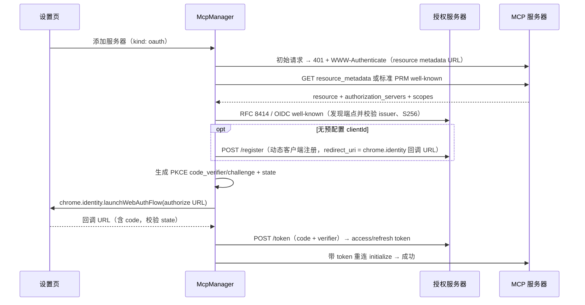

# 远端 MCP

> 文档入口：[用户指南](../guide/index.md) · 关联：[Agent 引擎](./agent-engine.md) · [权限](./permissions.md) · [界面](./ui.md)

---

## 1. 范围与架构

仅支持远端 MCP，扩展内直连、零安装。本地 stdio 服务器需要 Native Host，超出「零本地程序」原则，不做。运行时使用 `@modelcontextprotocol/sdk` 的浏览器安全 Client 与 Streamable HTTP transport；不实现旧式独立 SSE endpoint transport。

```
McpManager (background)
 ├─ McpWorkerClient —— 轻量 runtime RPC 与 capability 镜像
 ├─ offscreen document —— SDK Client/StreamableHTTPClientTransport（每服务器一会话）
 ├─ AuthManager —— Bearer / OAuth 2.1（token 刷新、过期重授权）
 └─ Registry 桥接 —— tools → AgentTool；prompts → `/server:prompt`；resources → `@`
```

offscreen document 承载网络会话和数据导入 canonical 校验，没有可见 UI 或页面访问能力。数据导入通道使用固定 Port 名、扩展 ID 与精确 worker URL 鉴权，并由 background 对输入与校验结果分别复算 digest；把 SDK 和重型导入校验器从 background bundle 分离是为满足 MV3 Service Worker 生命周期与包体预算。

## 2. 服务器配置

```ts
// chrome.storage.local: 'mcp_servers'
interface McpServerConfig {
  id: string;
  name: string;
  url: string; // https://mcp.example.com/mcp
  auth:
    | { kind: 'none' }
    | { kind: 'bearer'; token: string }
    | {
        kind: 'oauth';
        clientId?: string; // 缺省走动态客户端注册（DCR）
        scopes?: string[];
        binding?: { resource: string; issuer: string }; // clientId/token 的安全绑定
        tokens?: { access: string; refresh?: string; expiresAt: number };
      }; // access 存 storage.session
  enabled: boolean;
  disabledTools: string[]; // 逐工具启停
  connectOnStartup: boolean; // false 时首次使用再懒连接
}
```

设置页支持粘贴 JSON 导入（兼容 Claude Code `mcpServers` 与 Cursor 配置片段）、连接/断开、逐工具启停、OAuth 授权和删除。Provider/MCP/page origin 统一经 `HostPermissionBroker`；缺少 host permission 时先形成审批，浏览器权限请求由用户点击触发。

后台启动只连接 `enabled && connectOnStartup` 的服务器；其它 enabled 服务器在首次列能力或调用时懒连接。storage 变化会 reconcile 已连接会话；URL 全路径或认证绑定变化时会先通过 disconnect barrier 关闭旧 client，再按 `connectOnStartup` 恢复连接或懒连接语义。候选 client 在握手后还会复验当前配置，不会把漂移的会话提交为 ready。

同一 server 的并发连接请求共享一个进行中的 attempt；connect、disconnect、reconnect 按 server 串行，disconnect 形成屏障，后续 connect 不会错误复用屏障前的 attempt。候选 client 只有在完整握手后才进入 ready map，失败或断开会关闭候选并移除 runtime listener。background 与 offscreen 之间除 `serverId` 外还有每个 client 实例唯一的 `connectionId`；热重连或两个 background 实例交叠时，旧实例的 changed/call/close 不能读取、调用或关闭新会话，握手较晚完成的过期候选也不能覆盖当前 owner。offscreen worker 返回的 envelope、catalog、tool result、prompt 和 resource 均在写入目录或返回调用方前做运行时校验，畸形 changed event 不污染已有目录。OAuth DCR 返回的 `client_id` 在持久化和授权前必须通过对象、非空字符串与长度校验。

## 3. OAuth 2.1 时序

实现以 MCP Authorization `2025-06-18` 为兼容底线，并采用 `2025-11-25` 中明确的 discovery、OIDC fallback、scope challenge 和 PKCE 能力校验规则。仓库固定使用 `@modelcontextprotocol/sdk` `1.29.0`，并复用它的 `WWW-Authenticate` 解析。

PRM 与授权服务器 discovery 按 SDK 的端点顺序在后台实现。没有直接引入 SDK auth discovery，因为这会让 MV3 `background.js` 超过 350 KiB 预算。当前实现不包含 SDK 的 CORS 去除请求头重试，但保留 `redirect: 'error'`，并检查同源 PRM、resource、issuer、远程 HTTPS 和 `S256`。

项目目前没有公开托管的 Client ID Metadata Document，因此使用预配置 client ID 或 DCR，不声明 CIMD 支持。



- redirect_uri 固定为 `https://<extension-id>.chromiumapp.org/mcp-oauth`；
- 401 中的 `resource_metadata` 优先于 well-known 探测，但只接受与 MCP URL 同源的远程 HTTPS URL（显式 loopback 开发地址可用 HTTP）；缺少该参数时按 path-aware PRM、root PRM 顺序回退；
- PRM 的 `resource` 必须与 canonical MCP resource 匹配，`authorization_servers` 必须非空。首次发现多个授权服务器时不猜测选择并返回明确错误；已有 resource + issuer 绑定仍在列表中时可继续选择原 issuer；
- issuer 含 path 时依次尝试 RFC 8414 path insertion、OIDC path insertion、OIDC path append；无 path 时依次尝试 RFC 8414 与 OIDC。返回 metadata 的 `issuer` 必须与所选 issuer 完全一致，并明确声明 `code_challenge_methods_supported: ['S256', ...]`；
- challenge 的 `scope` 是本次授权的权威输入；运行中收到 `403 insufficient_scope` 时执行 step-up authorization；没有 challenge scope 时才使用 PRM 或服务器配置的 scopes；
- client ID、access token 与 refresh token 都绑定到 canonical resource + issuer。PRM 改变 issuer 或服务器 URL 改变 resource 后，旧 client ID/token 不会发送给新授权服务器；access token 的 session key 与 refresh token 的 AES-GCM purpose 也按该绑定隔离；
- OAuth access token 仅存 `chrome.storage.session`；refresh token 和 Bearer token 在 local 中使用本机 AES-GCM 封装。401 时先尝试 refresh/重新授权，失败把 manager 状态标记为明确的 discovery/授权错误；
- 当前 OAuth 从设置页“授权”按钮触发 `launchWebAuthFlow({interactive:true})`。无 UI 的后台任务无法完成交互式重授权，manager 只会进入 error 状态；尚无任务暂停通知或系统通知链路。

## 4. 能力消费映射

| MCP 能力                         | 当前状态                                             | 说明                                                                                                                                                                                                                                                                                         |
| -------------------------------- | ---------------------------------------------------- | -------------------------------------------------------------------------------------------------------------------------------------------------------------------------------------------------------------------------------------------------------------------------------------------- |
| Tools                            | 已接入 `AgentTool`，name = `mcp__{serverId}__{tool}` | 当前没有服务器可信配置，所有远程工具均以 effects:'write' / never-retry 注册并进入写工具审批策略；`annotations.readOnlyHint` 等服务器自报 annotation 只作展示，不能降低审批或重试风险。原始 inputSchema 通过 `AgentTool.jsonSchema` 原样送达 Provider，运行时保留宽松解析并由 server 最终校验 |
| Prompts                          | 已接入 `/server:prompt` 与参数表单                   | manager 调用 `prompts/get`，返回内容作为不可信 ContextBlock 附加到用户消息                                                                                                                                                                                                                   |
| Resources                        | 已接入 `@` 搜索与读取                                | `resources/list` 形成候选；选择后 `readResource`，内容随机定界且标记 MCP provenance                                                                                                                                                                                                          |
| notifications/tools/list_changed | 已监听                                               | offscreen Client 用刷新代次提交 catalog 并通知 background 重建工具注册表；并发刷新只有最新一代可提交，某一类别临时失败时保留该类别最后一次有效目录，不把网络抖动解释为服务器删除全部能力                                                                                                     |

工具调用默认超时 60s；Run interrupt/abort 会沿 AgentTool → background worker client → offscreen SDK 的同一 `operationId` 取消请求。offscreen worker 会用短期、有界且按连接定界的取消记录覆盖 cancel 先于 call admission 到达的并发窗口；排队等待 Elicitation 上下文的调用若先被取消，也不会在前序调用结束后重新派发。结果按[浏览器工具](./browser-tools.md) §7 的体积规范截断。

## 5. 健康与调试

- manager 内存中有 `disconnected → connecting → ready → error(reason)` 状态机和错误归因函数；
- 设置页可读取 manager 状态、tool count、catalog，并维护 disabledTools；
- 尚无每服务器最近 50 条请求/响应日志、日志抽屉或导出能力。

## 6. 非目标

- Elicitation：支持 `form` 模式。MCP 工具调用期间，服务器请求被转成持久 `mcp_elicitation` 交互卡，用户接受、拒绝或取消后再回到原调用；`url` 模式当前明确 decline。由于远端 HTTP 调用无法跨 Service Worker 中断续接，恢复时不会假装答案已送达服务器，而是给模型返回明确失败，只有确认重试安全后才能重发 MCP 工具。
- resources subscribe 的推送更新。
- 本地 stdio 服务器（需 Native Host，违反零本地程序原则）。
