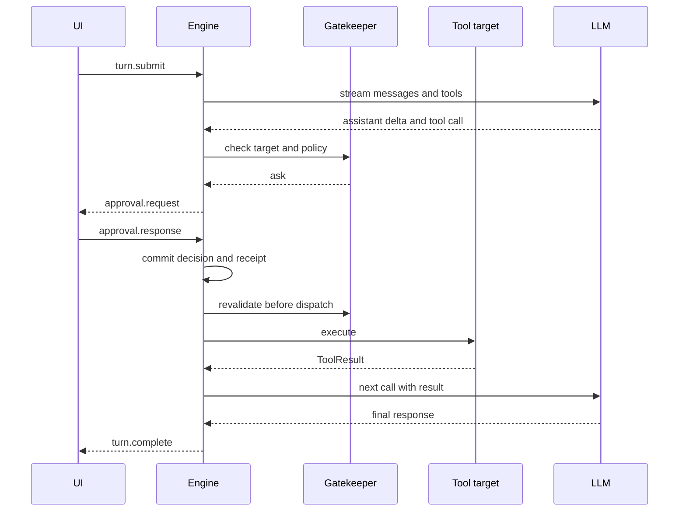

# Agent engine

> Related: [Architecture](./architecture.md), [Data model](./data-model.md), [Permissions](./permissions.md), and [Prompts](./prompts.md).

## 1. Execution

The agent loop continues until the model requests no more tools. Gatekeeper, the Run environment, and UI manage approvals, tool scope, and presentation outside the loop.

An optional token budget pauses a Turn with `budget_pause`; it is not a step counter. After three consecutive tool failures, the loop asks the model to change approach. After five, it disables tools and asks for one final response. Success resets the count. User and policy denials are not tool failures.

## 2. Agent loop

At Turn admission, one transaction stores `turn_context`, the user message, and the streaming Run state. Each model-call boundary materializes durable steering messages, derives session context, streams provider events, and stores the final assistant message, usage, cost, Thread statistics, and Run cursor.

For every tool call, the engine prepares a stable node identity, asks Gatekeeper, persists any approval request, validates the decision, executes the tool, and stores a result with the next Run state. Tool errors become error results that the model can use to correct its next action.

Before persistence, the engine replaces empty or session-duplicate provider call IDs with unique IDs. Interleaved persistence of parallel calls and results still rebuilds one assistant tool-call batch. Tool calls paired with a non-`tool_use` stop reason are protocol errors and fail before any tool side effect.

Interrupt aborts the current fetch and tool, then detaches L2 tools. Stored nodes remain, and the Turn ends as interrupted. Provider `tool_use` continues the loop; final `end`, `max_tokens`, and `content_filter` stop reasons enter the Run and UI. `turn.complete` is emitted only after required writes finish.

Title generation starts in parallel on the first Turn. It writes a first-line fallback before a best-effort task-model call. Follow-up suggestions are not currently implemented.

## 3. Steering, queueing, and interrupt

| Path | Op | Meaning | Limit |
| --- | --- | --- | --- |
| Steering | `turn.steer{expectedTurnId}` | Persist input for the next model call in the current Turn | Reject a stale or ended Turn ID |
| Queueing | `turn.enqueue` | Start a later Turn after the current one | Eight queued entries per Thread |
| Interrupt | `turn.interrupt` | Stop the current Turn | Always allowed |

A steering acknowledgement means the message and attachment references are durable. The loop captures one admission cutoff before each provider request. Messages admitted after that cutoff wait for the next call. They never appear between a tool call and result or before an assistant response that did not see them.

On final response, the loop stops new admission, waits for started persistence, and performs another request if an acknowledged steering message remains. Recovery reads pending steering from the Run instead of memory.

## 4. AgentTool contract

Every local, browser, MCP, or built-in tool registers one descriptor containing its name, label, model-facing description, runtime parameter schema, optional provider JSON Schema, level, effects, recovery class, optional target resolver, and execution function.

`ToolResult.content` is concise model-facing information. `details` contains UI-only screenshots, snapshot diffs, coordinates, or other rich data. A conclusion needed by the model cannot exist only in `details`.

Runtime validation errors become tool results for model correction. Long operations can report progress through `onUpdate` and `item.delta`.

`ToolRegistry.register()` is the capability metadata boundary. It normalizes and deep-freezes schema, security metadata, provenance, trust, and execution binding. MCP bindings include server, endpoint, and authentication identity. Provider schemas and Run tool catalogs derive from the same descriptor.

Model capability metadata is part of the Run environment. An explicit `toolUse:false` binds an empty Registry for both new and recovered Runs. `vision:false` removes `screenshot` from a new Run catalog and rejects existing image history before the provider call.

Descriptor digests cover schema, safety metadata, and binding. Recovery obtains one atomic implementation-and-descriptor generation so MCP reconnect cannot replace a tool between digest and execution.

## 5. Recovery

One `ThreadActor` serializes each Thread. A queued Run may resolve its environment for the first time. A started Run must validate the versioned environment snapshot and digest. Approval and interaction states are restored from their tables.

A recovered waiter owns its Thread until one continuation claim finishes. New Turns queue, while branch switching, fork, and unrelated resume commands are rejected. An ordinary interaction response is claimed once. MCP elicitation cannot resume a lost remote call, so recovery tells the model to repeat it only when safe.

Unknown write outcomes enter `paused_uncertain` for user resolution. Interrupted model streams enter `interrupted`. Recovery rejects prompt, schema, safety metadata, provider transport, MCP endpoint, or binding drift. Encrypted secret values may rotate behind an unchanged credential reference.

### 5.1 Command transaction units

`CommandTransactionContext` is an internal engine and database identity, not a protocol object. Domain repositories verify the receipt identity and finish it inside the same Dexie transaction as domain state.

Atomic coverage includes Thread create, delete, empty fork, and branch selection; Run enqueue and queue mutation; approval decisions; and interaction responses. A repeated identical submission replays the terminal response. A changed payload is rejected without overwriting the first decision or adding another audit node.

An acknowledgement means the domain decision is stored, not that all continuation work has finished. Idle Turn admission, steering, interrupt, and recovery commands still cross multiple execution stages and rely on stable identities, checkpoints, and the recovery state machine.

## 6. Sequences

### 6.1 Turn with approval

### 6.2 Service worker recovery

After Port disconnect, the UI reconnects and initializes its Thread subscription. The new worker replays metadata and context, returns a snapshot with unfinished state, and offers recovery. Stored tool-result checkpoints remain in the model history.

## 7. Transport

`EngineTransport` exposes `send(op)` and `onEvent(callback)`. Production uses a Chrome runtime Port. Vitest uses `DirectTransport` to connect a mock provider and the engine without Chrome APIs.

## 8. Current constraints

Steering enters only between model calls, not during tool execution. Use interrupt when a tool cannot finish first. Panelot does not implement subagents. `parentThreadId` is used for normal Thread fork ancestry.
