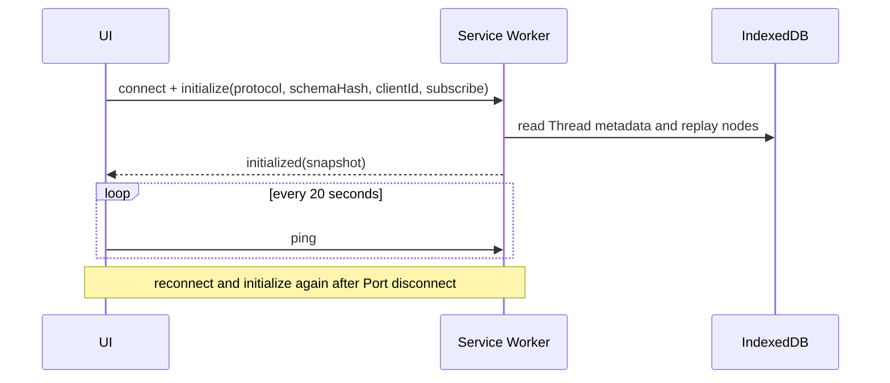

# Architecture and messaging

> Related: [Data model](./data-model.md), [Agent engine](./agent-engine.md), [Browser tools](./browser-tools.md), and [Permissions](./permissions.md).

## 1. Context topology

Panelot is a Chrome and Edge MV3 extension with several execution contexts:

```text
Side panel / chat tab / options page
  -> chrome.runtime Port
Background service worker
  - RealEngineCore and EngineHost
  - GatekeeperService
  - SettingsProviderResolver
  - BrowserToolGateway
  - McpManager <-> offscreen MCP worker
  - ThreadTree and PanelotDB
  -> chrome.tabs.sendMessage -> content script and L1 executor
  -> chrome.debugger -> L2 CDP tools
```

The background engine is the only authority that mutates conversation, approval, and tool-execution state. Several UIs may subscribe to one Thread. They combine persisted snapshots with live events and can reconnect without owning the task.

## 2. Thread, Turn, and Item

| Primitive | Meaning | Lifecycle |
| --- | --- | --- |
| Thread | One branching conversation | Created, active or idle, then archived or deleted |
| Turn | One user exchange containing model calls and tools | `turn.start`, Items, then `turn.complete` |
| Item | One assistant message, reasoning block, tool call, approval, or notice | `item.start`, zero or more `item.delta`, then `item.complete` |

Protocol Items and persisted node types are related but distinct. Nodes also include tool results, approval decisions, interaction responses, and turn context that are not streamed as Item kinds.

## 3. Port messaging protocol

### 3.1 Shape and validation

Clients send an `Op` with a client-generated UUID `submissionId`. The engine sends `AgentEvent` records and returns the `submissionId` on direct responses. Shared types live in `src/messaging/protocol.ts`.

Known events pass a unique field-level runtime validator. Unknown event types are ignored for forward compatibility. A malformed known event is a protocol mismatch. Both directions apply depth, fan-out, field-count, text, and binary budgets before detailed validation.

`ENGINE_SCHEMA_HASH` and `CONTENT_SCRIPT_SCHEMA_HASH` come from semantic TypeScript manifests checked by `scripts/check-protocol-manifests.mjs`. A reviewed contract change requires `pnpm protocol:write`. Comments and formatting do not change the hash.

### 3.2 Client operations

The main operation families are initialization and subscription; Thread create, delete, fork, and branch selection; Turn submit, fork, steer, enqueue, and interrupt; queue update and removal; Run recovery; approval and interaction responses; and heartbeat ping.

`turn.submit` is the client command. The engine emits `turn.start` only after admission. Refer to `Op` in `src/messaging/protocol.ts` instead of copying a type from this document.

### 3.3 Engine events

The engine reports initialization snapshots, command acknowledgements or rejections, typed errors, Turn lifecycle, Item lifecycle, token usage, approval and interaction requests, Thread updates, queue updates, and recovery requirements.

`fatal.reload_required` is a minimal stable envelope for protocol or schema mismatch. It allows an old UI to stop reconnecting and request an extension reload. Other known events remain strict.

### 3.4 Handshake and command identity



EngineClient stores unacknowledged commands in a `chrome.storage.session` outbox and resends the same `clientId + submissionId`. The background adds `commandType` and a SHA-256 fingerprint of canonical payload fields to the transaction identity. A reused submission with changed type or payload is rejected.

Thread create, delete, empty fork, branch selection, queue mutation, approval response, and interaction response commit domain state and the receipt terminal state in one Dexie transaction. An acknowledgement means that decision is durable. Continuation work such as rule application, tool dispatch, or model resume may still follow.

### 3.5 Backpressure

EngineHost keeps a per-Thread Op queue of 32 entries and rejects overflow as `overloaded`. It coalesces consecutive `item.delta` text updates for the same Item at a 16 ms boundary before posting them to Ports.

## 4. Service worker lifecycle

Provider fetches, tool promises, and Port heartbeats progress while the worker is alive. Nodes and Run cursors are checkpointed at defined transaction boundaries. After worker termination, the UI reconnects and the Run reducer restores queues and waiting state. Read-only or retry-safe tools can be replayed; writes with an unknown outcome enter `paused_uncertain`.

A 30-second alarm can wake recovery without a visible UI. Interactive authorization still requires the user. The extension does not currently delay reload through `onUpdateAvailable`.

## 5. Tool routing

```text
tool_call
  -> Gatekeeper decision
  -> L0 or L1: chrome.tabs.sendMessage to an explicitly resolved tab
  -> L2: serialized chrome.debugger attachment and CDP command
  -> MCP: McpManager.callTool
  -> built-in: execute inside the engine
```

Content-script requests validate ownership, schema hash, tool parameters, successful results, action evidence, and structured failures. Unknown or oversized messages do not reach the DOM executor. CDP attachments are tracked per tab and detach after 30 seconds of inactivity.

## 6. Current constraints

- Protocol mismatch requires an extension reload. Unknown events can be ignored, but malformed known events cannot.
- Each browser window selects a side-panel Thread independently. Shared subscriptions stay synchronized through broadcasts.
- L1 to L2 escalation uses the normal `approval.request` event with an `escalation_l2` flag.
