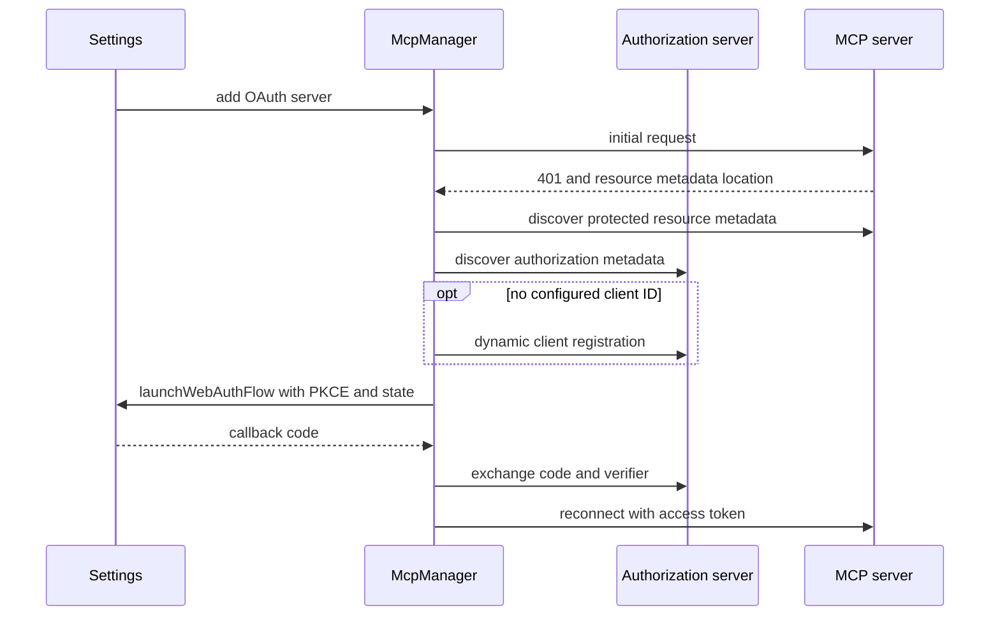

# Remote MCP

> Related: [Agent engine](./agent-engine.md), [Permissions](./permissions.md), and [UI](./ui.md).

## 1. Scope and architecture

Panelot connects directly to remote MCP servers over Streamable HTTP. It does not implement local stdio, which would require a Native Host, or the older standalone SSE transport.

```text
McpManager in background
  - McpWorkerClient for bounded runtime RPC and catalog mirrors
  - offscreen document with one SDK Client session per server
  - AuthManager for bearer and OAuth 2.1
  - Registry bridge: Tools to AgentTool, Prompts to /server:prompt, Resources to @
```

The offscreen document owns SDK network sessions and canonical data-import validation. It has no visible UI or page access. Background authenticates import Ports and rechecks request and result digests.

## 2. Server configuration

`McpServerConfig` stores ID, name, URL, none, bearer, or OAuth authentication, enabled state, disabled Tool names, and startup-connect preference. OAuth access tokens use `chrome.storage.session`; refresh and bearer tokens use local encrypted envelopes.

Settings can import Claude Code `mcpServers` and Cursor-style JSON, connect or disconnect, toggle individual Tools, start OAuth, and remove servers. Host access for providers, MCP servers, and pages uses one broker and can be requested only from user interaction.

Only enabled servers with `connectOnStartup` connect during background startup. Other enabled servers connect when capabilities or a call are first needed. Changes to the complete URL or authentication binding pass through a disconnect barrier before another client is eligible.

Concurrent attempts for one server share an in-flight connection. Connect, disconnect, and reconnect are serialized per server. A unique `connectionId` prevents an old background instance or delayed candidate from reading, calling, closing, or replacing the current session.

Worker envelopes, catalogs, Tool results, Prompts, and Resources pass runtime validation before they reach a registry or caller. A malformed change notification does not erase a valid catalog. Dynamic client registration must return a bounded non-empty `client_id`.

## 3. OAuth 2.1

The implementation uses MCP Authorization `2025-06-18` as its compatibility floor and follows the later discovery, OIDC fallback, scope challenge, and PKCE rules documented for `2025-11-25`. The repository pins `@modelcontextprotocol/sdk` 1.29.0.

Panelot performs protected-resource metadata and authorization-server discovery in background to keep SDK auth code out of the MV3 bundle budget. It verifies same-origin resource metadata, remote HTTPS except explicit loopback development, exact issuer identity, and advertised `S256` support. The project does not publish a Client ID Metadata Document, so it uses a configured client ID or dynamic registration.



The redirect is `https://<extension-id>.chromiumapp.org/mcp-oauth`. Resource metadata location must match the MCP origin. When discovery returns several issuers for the first time, Panelot does not guess. Resource, issuer, client ID, and tokens remain bound so credentials cannot move to a changed server or issuer.

A challenge scope is authoritative for that authorization. A later `403 insufficient_scope` starts step-up authorization. Interactive authorization begins only from the settings button. A background task can enter an explicit error state but cannot open a login flow itself.

## 4. Capabilities

| Capability | Integration |
| --- | --- |
| Tools | Register as `mcp__{serverId}__{tool}` with write effects and `never-retry`; server annotations are display-only |
| Prompts | Register as `/server:prompt`; returned content is an untrusted ContextBlock |
| Resources | List in `@`; selected content is randomly bounded and marked with MCP provenance |
| `tools/list_changed` | Refresh a generation and commit only the latest valid catalog while retaining the last valid category on temporary failure |

Tool calls time out after 60 seconds. Run abort follows the same `operationId` through background and offscreen SDK. Bounded cancellation records cover cancellation that arrives just before call admission.

## 5. Health and debugging

McpManager exposes `disconnected`, `connecting`, `ready`, and attributed `error` states. Settings shows connection state, Tool count, catalog, and disabled Tools. There is no request-log drawer or last-50-request export.

## 6. Non-goals and limits

Form-mode Elicitation is supported through a durable interaction card. URL-mode Elicitation is declined. A remote HTTP call cannot continue after service worker interruption, so recovery reports failure rather than claiming the response reached the server. Resource subscriptions and local stdio servers are not supported.
